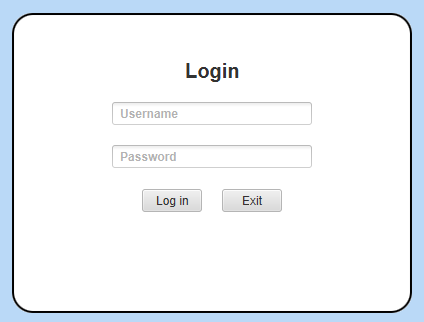
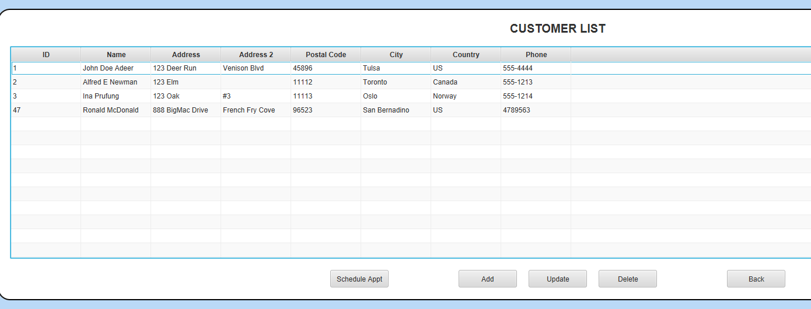
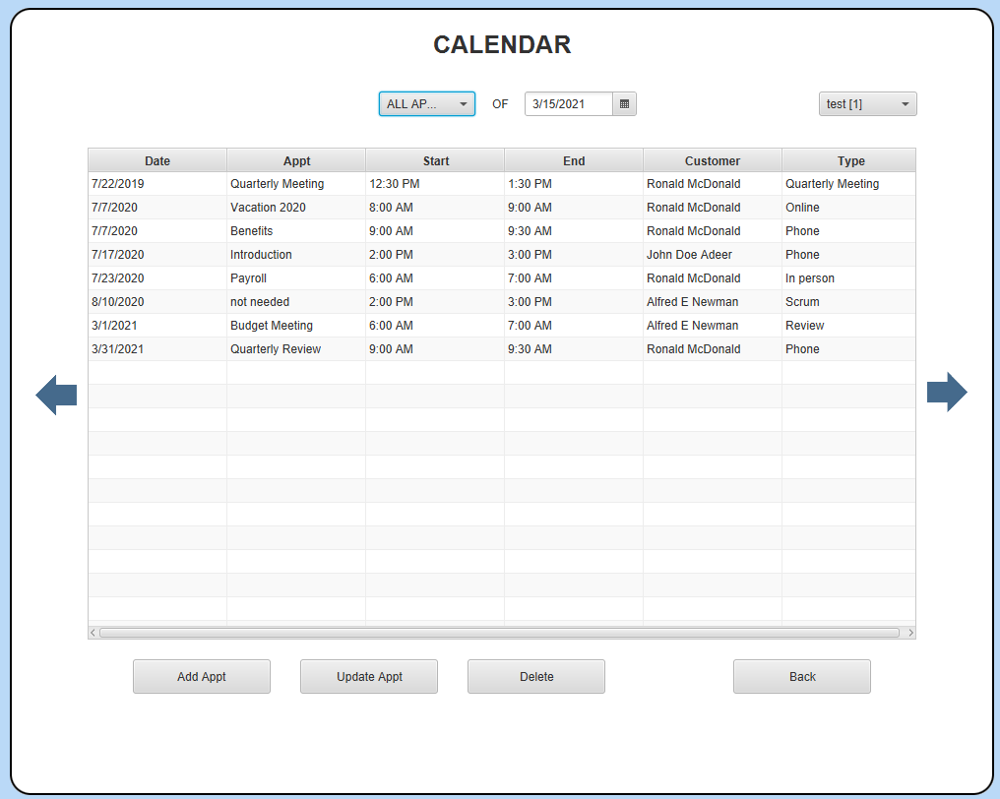

# Java CRM

## Description
This Java application serves as a customer relationship management (CRM) system. It allows users to add, update, and remove customer data; manage appointments in a calendar; and run reports on appointment data.

This application was developed to fulfill the requirements for an Advanced Java Concepts academic project at WGU. It demonstrates database and file server application development skills. The application incorporates lambda expressions; advanced exception control mechanisms to improve user experience and application stability; localization and date/time APIs to support end-users in various geographical regions; and streams and filters to manipulate data more efficiently.

## Installation
Prerequisites:
* Download and install [Java Runtime Environment (JRE) 8](https://www.oracle.com/java/technologies/javase-jre8-downloads.html) or higher

Steps:
1.	Install the prerequisite applications
2.	Download [dist.zip file](dist.zip)
3.	Extract files and run java-crm.jar

## Using the Application
The login screen will appear upon starting the application.

Enter your credentials and click the “Login” button. Once logged in, the menu will appear.

Use the buttons to navigate to other screens where you can view/manage customers, appointments, or reports.

## Future Improvements
* Optimize colors and fonts for improved accessibility
* Improve design of reports screen
* Add ability to download/save reports
* Add section to README outlining how to test localization settings
* Add more detail to README under "Using the Application" section:
  * Explain screenshots
  * Explain required fields and input validation

## Project Status
This project was created for an academic course. Development will be discontinued for the foreseeable future.
